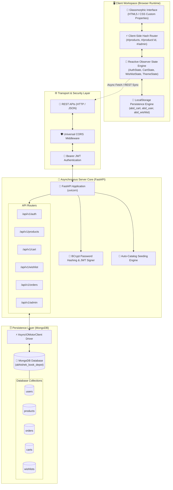
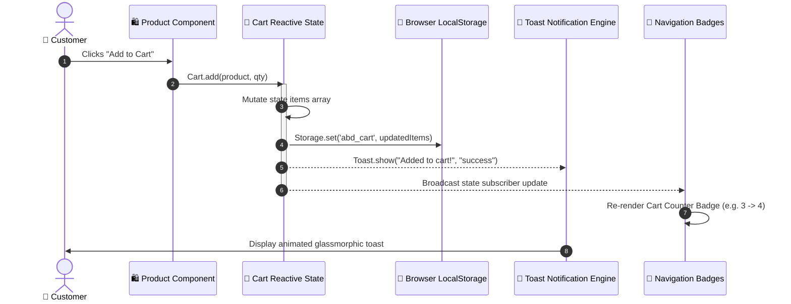
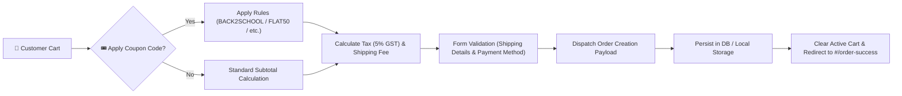
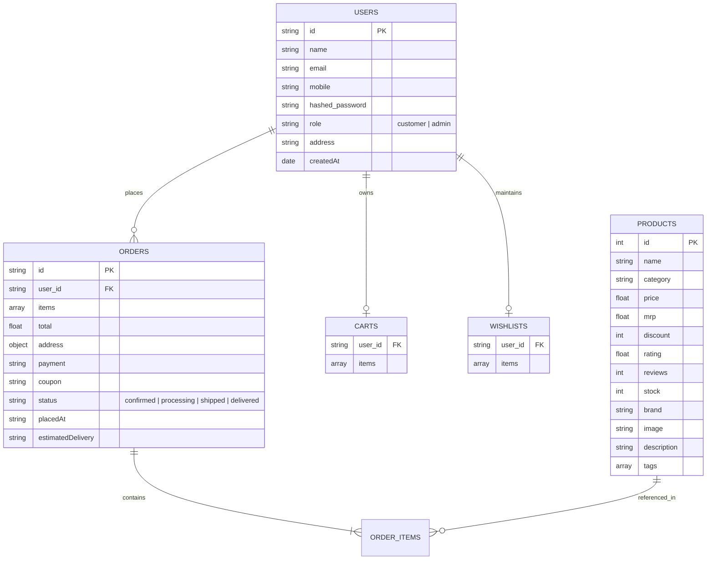

<div align="center">

# 📚 ABHISHEK STATIONERY & ART GALLERY
### *The Modern Digital Sanctuary of Literature, Fine Art & Precision Supplies*

[](https://fastapi.tiangolo.com/)
[](https://www.mongodb.com/)
[](https://www.python.org/)
[](https://developer.mozilla.org/en-US/docs/Web/JavaScript)
[](https://web.dev/progressive-web-apps/)
[](LICENSE)

---

**[Explore Store](#-architectural-overview) • [API Documentation](#-api-blueprint-matrix) • [Client Mechanics](#-frontend-reactive-state-engine) • [Quick Start](#-quick-start-guide)**

</div>

---

## 🌟 Executive Summary

**Abhishek Stationery & Art Gallery** (famously known as *Abhishek Book Depot*) is an enterprise-grade, full-stack E-Commerce platform tailored for art supplies, academic textbooks, office equipment, luxury pens, and handcrafted gifts. 

Engineered with a **zero-dependency, native ES6+ vanilla frontend** connected to a high-performance **asynchronous Python FastAPI & Motor MongoDB backend**, the application delivers sub-millisecond dynamic client rendering, seamless dark/light theme switching, interactive administrative controls, and resilient hybrid offline/online catalog persistence.

---

## 🎨 System Architecture Blueprint

The platform employs a hybrid architecture designed for maximal uptime, zero render delay, and seamless client-server data synchronization.



---

## ⚡ Client-Side Reactive State Engine

Instead of pulling in heavy frontend framework bundles, the app utilizes an in-house **Observer-Pattern Reactive State Engine** implemented in [`js/app.js`](file:///c:/Users/Admin/Desktop/coding/antigrav/abhishek-book-depot/js/app.js).



---

## 🛒 Checkout & Order Processing Pipeline



---

## 🍃 MongoDB Entity Relationship Diagram (ERD)



---

## 🔥 Key Architectural Features

### 1. 🚀 Native ES6 Single Page Application (SPA)
* **Zero Build Step:** Uses pure native ES6 ECMAScript modules (`import`/`export`) running directly in any modern web browser without Webpack, Vite, or Babel overhead.
* **Hash-Based Router:** Custom router support with dynamic route parameter extraction (`#/product/:id`, `#/search?q=query`, `#/admin/*`).
* **Micro-Animations & Aesthetics:** Powered by custom CSS variables, glassmorphism, responsive grid containers, and smooth UI transitions.

### 2. ⚡ High-Performance Asynchronous Python FastAPI Engine
* **Non-Blocking I/O:** Leverages Python `async`/`await` primitives with `uvicorn` and `AsyncIOMotorClient`.
* **Auto Database Seeding:** Intelligent startup hook (`lifespan`) automatically populates standard product catalogs if MongoDB is empty.
* **Role-Based JWT Security:** Secure access tokens using `python-jose` with `bcrypt` password hashing.

### 3. 🔍 Smart Instant Search & Live Filters
* **Debounced Execution:** Client-side search input is debounced (200ms delay) to prevent UI thread thrashing.
* **Multi-Attribute Matching:** Matches product queries against title, brand, category, and descriptive tags.
* **Granular Filters:** Interactive price range sliders, star rating toggles, category selectors, and multi-tier sorting (price ascending/descending, top rated, highest discount).

### 4. 🎟️ Intelligent Coupon & Discount Engine
* **Dynamic Coupons:** Support for percentage discounts (`BACK2SCHOOL` for 20%, `BOOKFAIR25` for 25%) and flat discounts (`FLAT50`).
* **Real-time Price Engine:** Calculates MRP savings, GST charges, free shipping thresholds (₹499+), and total cart summaries on the fly.

### 5. 👑 Comprehensive Admin Control Center
* **Live Catalog Management:** Add, edit, filter, and delete inventory items.
* **Metrics & Analytics:** Real-time summary cards for total revenue, active orders, product counts, and low-stock alerts.
* **Category Filters:** Filter administrative inventory by stationery, art supplies, luxury pens, and books.

---

## 📁 Repository Directory Structure

```
abhishek-book-depot/
├── 📄 index.html              # Main HTML5 entry point & application shell
├── 📄 manifest.json            # PWA manifest specification & standalone app icon configuration
├── 📄 .gitignore               # Ignored temporary runtime files & Python caches
├── 📂 css/
│   └── 🎨 style.css           # Complete design system (CSS variables, dark mode, animations)
├── 📂 js/
│   ├── ⚡ app.js               # Reactive State classes, Auth, Cart, Wishlist, Storage & Router
│   ├── 📦 components.js        # Reusable UI component renderers (Navbar, Footer, Product Cards)
│   ├── 🗃️ data.js              # Fallback product catalog & category definitions
│   ├── 🚀 main.js              # Application entry point, global event handlers & routes
│   └── 📑 pages.js             # Page-level template renders (Home, Products, Admin, Detail)
├── 📂 backend/
│   ├── ⚙️ main.py              # FastAPI application server entry point & lifespan manager
│   ├── 🗄️ database.py          # Motor AsyncIOMotorClient MongoDB connection factory
│   ├── 🔒 security.py          # Password hashing, verification, & JWT token signer
│   ├── 🌱 seed_data.py          # Catalog seed data generator for MongoDB startup initialization
│   ├── 📋 requirements.txt     # Python backend dependencies (FastAPI, uvicorn, motor, pymongo)
│   ├── 📂 models/              # Pydantic data validation schemas
│   │   ├── 📄 product.py
│   │   ├── 📄 user.py
│   │   ├── 📄 order.py
│   │   └── 📄 cart.py
│   └── 📂 routers/             # Asynchronous API endpoints
│       ├── 🌐 auth.py
│       ├── 🌐 products.py
│       ├── 🌐 cart.py
│       ├── 🌐 wishlist.py
│       ├── 🌐 orders.py
│       └── 🌐 admin.py
└── 📂 assets/                  # Product imagery & static media assets
```

---

## 📡 API Blueprint Matrix

| Module | Endpoint | Method | Auth | Description |
| :--- | :--- | :---: | :---: | :--- |
| **System** | `/` | `GET` | ❌ | Health check and server status |
| **Auth** | `/api/v1/auth/register` | `POST` | ❌ | Register new customer account |
| **Auth** | `/api/v1/auth/login` | `POST` | ❌ | Authenticate credentials & generate JWT |
| **Auth** | `/api/v1/auth/me` | `GET` | 🔒 | Get current authenticated user details |
| **Products** | `/api/v1/products` | `GET` | ❌ | List products with search, cat, & price filters |
| **Products** | `/api/v1/products/{id}` | `GET` | ❌ | Fetch detailed product metadata |
| **Products** | `/api/v1/products` | `POST` | 🔑 Admin | Add new product to catalog |
| **Products** | `/api/v1/products/{id}` | `DELETE`| 🔑 Admin | Delete product from catalog |
| **Cart** | `/api/v1/cart` | `GET` | 🔒 | Retrieve user cart items |
| **Cart** | `/api/v1/cart/add` | `POST` | 🔒 | Add product item to cart |
| **Orders** | `/api/v1/orders` | `POST` | 🔒 | Create and place a new purchase order |
| **Orders** | `/api/v1/orders` | `GET` | 🔒 | List user order history |
| **Admin** | `/api/v1/admin/stats` | `GET` | 🔑 Admin | Retrieve store analytics dashboard stats |

---

## 🛠️ Quick Start Guide

### Prerequisites
- **Node.js / Live Server** (Optional for local static server execution)
- **Python 3.10+** (Required for FastAPI backend)
- **MongoDB** (Optional local instance or MongoDB Atlas URI)

---

### Option 1: Standalone Client Mode (Immediate Run)

Because the client application is designed with an offline-first fallback engine, you can launch the store interface directly without setting up a backend!

1. **Open [`index.html`](file:///c:/Users/Admin/Desktop/coding/antigrav/abhishek-book-depot/index.html)** in any modern web browser (Chrome, Edge, Firefox, Safari).
2. Alternatively, serve using a static web server:
   ```bash
   npx serve .
   ```
3. Navigate to `http://localhost:3000` in your browser.

---

### Option 2: Full-Stack Mode (FastAPI + MongoDB Engine)

To enable persistent server database synchronization and live API authentication:

#### 1. Configure Python Backend Dependencies
```bash
cd backend
python -m venv venv

# On Windows:
venv\Scripts\activate

# On macOS/Linux:
source venv/bin/activate

pip install -r requirements.txt
```

#### 2. Configure Environment Variables
Create a `.env` file inside the `backend/` directory:
```env
MONGODB_URI=mongodb://localhost:27017
DB_NAME=abhishek_book_depot
JWT_SECRET=supersecretjwtkeyforabhishekbookdepot2026
JWT_ALGORITHM=HS256
ACCESS_TOKEN_EXPIRE_MINUTES=1440
PORT=8000
HOST=127.0.0.1
```

#### 3. Launch FastAPI Development Server
```bash
python main.py
```
The server will start at `http://127.0.0.1:8000`. Automatic OpenAPI documentation is available at:
* **Interactive Swagger UI:** `http://127.0.0.1:8000/docs`
* **Redoc UI:** `http://127.0.0.1:8000/redoc`

---

## 🎯 Default Admin Credentials

To access the interactive **Admin Control Center** at `#/admin`:
* **Email:** `admin@abhishek.com`
* **Password:** `admin123`

---

## 📄 License & Credits

Designed & Crafted with ❤️ for **Abhishek Stationery & Art Gallery**.
Licensed under the [MIT License](LICENSE).
